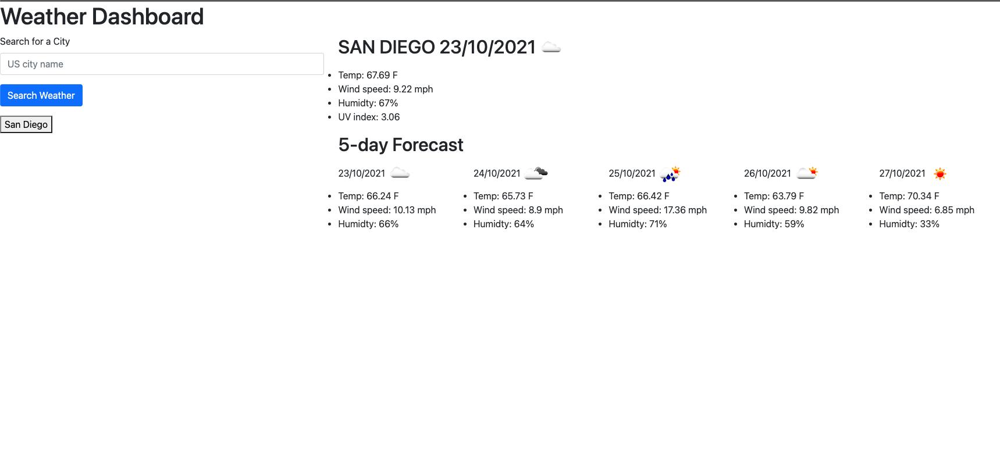

# Weather Dashboard

## Description
The objective of this project was to use a third party API, in this case OpenWeather One Call API, to create a web app that displays data from the API. This project uses OpenWeather One Call API to display the weather of a user inputted city. The weather displayed is the current weather and the five day forecast for that city.

[Deployed Application](https://reginaldcapanzana.github.io/weather-dashboard/)